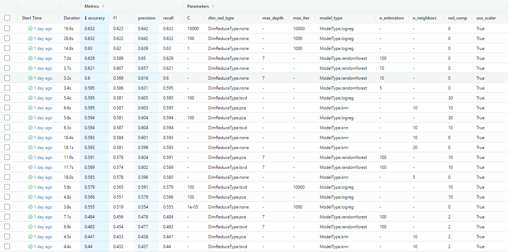

# Forest ML

## Usage

Package has two scripts:
* *eda* - for exploratory data analysis
* *train* - for training ML models

## Eda
**eda** generates HTML-file with statistic description of dataset (using pandas-profiling). Report can be opened from your browser.

Script may be launched from terminal like this:
```console
eda -d "data/train.csv"
```
Where:
* -d (--dataset-path) is path to .csv data file

## Train
**train** works in two modes:
* manual hyperparameters setting
* automatic hyperparameters tuning (with Grid/Random procedures)

Script may be launched from terminal like this:
### For manual setting: 
```console
train -d "data/train.csv" -s "data/model.joblib" --tuning 'manual' --model-type 'logreg' --random-state 42 --red-type 'pca' --use-scaler True c=100.0 max_iter=1000 
```

### For Random tuning:
```console
train -d "data/train.csv" --tuning 'auto_random' --model-type 'knn' --red-type 'pca' --use-scaler True n_neighbors='uniform(1,20)' weights=['uniform','distance'] 
```

### For Grid tuning:
```console
train -d "data/train.csv" --tuning 'auto_random' --model-type 'knn' --red-type 'pca' --use-scaler True n_neighbors='linspace(1,20)' weights=['uniform','distance'] 
```

Where:
* -d (--dataset-path) is a path to .csv data file. *Default*: data/train.csv
* -s (--save-model-path) is a path where model will store after training. *Default*: data/model.joblib
* --tuning is a choice of hyperparameters tuning type (manual|auto_random|auto_grid). *Default*: auto_random
* --model-type is a choice of model type (logreg|knn|randomforest). *Default*: logreg
* --random-state is a seed for reproducibility of results. *Default*: 42
* --red-type is a choice of reduction dimensionality algorithm (none|pca|tsvd). *Default*: none
* --use-scaler is a flag that tells to pipeline use standard scaler for data or not. *Default*: true
* other args is hyperparams for pipeline steps and must be in form param1=val1 param2=val2 and etc. Value of parameter can be any python expression.

This package tested on data with [Forest dataset](https://www.kaggle.com/competitions/forest-cover-type-prediction).

## Develop guide
Package uses [poetry](https://python-poetry.org/) for controlling dependencies. Please install it before launch and test.
After install poetry and activate virtual enviroment run from terminal
```console
poetry install
```
And poetry automatically will download and install dependencies. After you can launch train/eda scripts with poetry:
```console
poetry run train ...
```
```console
poetry run eda ...
```

## Experiment with manual hyperparameters tuning and CV
For estimating model performance chosen 4 metrics: 
* accuracy, 
* F1 weighted, 
* precision weighted, 
* recall weighted

Below table with results of experiment sorted by accuracy. 

